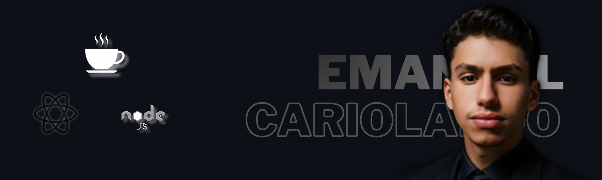
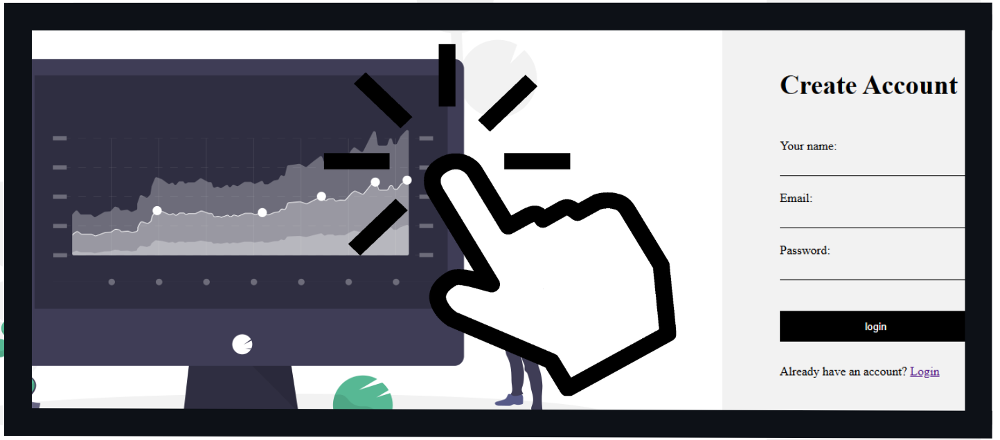

  

 

**Desenvolvedor Full Stack** apaixonado por tecnologia e desafios.  
Atualmente com foco em **Back-End (Java + Spring Boot)**, mas mantendo forte atuação no **Front-End com React**.

Desde **2021**, mergulhei no mundo da programação, começando com o desenvolvimento de **mods para jogos** e, ao longo do tempo, expandindo meus conhecimentos para **sistemas web e mobile**, utilizando **Java, Node.js, React e Android**.

---

## <h3 align="center"> 🚀 Tecnologias e Ferramentas <h3>

## <h3 align="center"> Back-End <h3>

  

 <h3 align="center"> Back-End <h3>

---

## 💡 Sobre mim

- 🔭 Foco atual: **Back-End com Java, Spring Boot com mongoDb + ApiRest**
- ⚙️ Explorando também: **React e NodeJs**
- 🎮 Comecei desenvolvendo **mods para jogos**
- 📚 Sempre buscando novos desafios e aprendizados.

---

<h3 align=center> 📊 Estatísticas</h3>

  

---

<h3 align="center">🌐 Entre em Contato! </h3>
 

  

  

---
<h3 align=center></h3>
<h3 align=center>🎨   Projetos   Reais Na Prática</h3> 

 

  
  

  <b>Sistema de Login com Spring Boot</b>
 

 

---

qualquer duvida me contrate ;)

