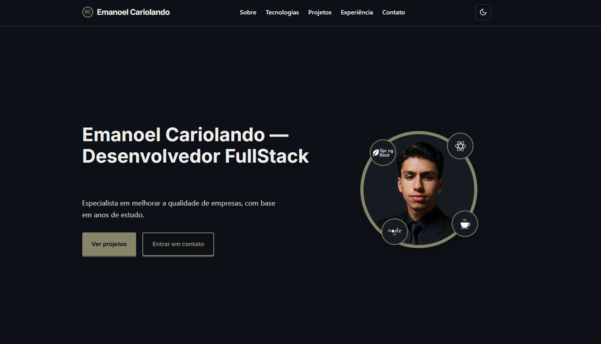

  

 

**Desenvolvedor Full Stack** apaixonado por tecnologia e desafios.  
Atualmente com foco em **Back-End (Java + Spring Boot)**, mas mantendo forte atuação no **Front-End com React**.

Desde **2021**, mergulhei no mundo da programação, começando com o desenvolvimento de **mods para jogos** e, ao longo do tempo, expandindo meus conhecimentos para **sistemas web e mobile**, utilizando **Java, Node.js, React e Android**.

---

## <h3 align="center"> 🚀 Tecnologias e Ferramentas <h3>

## <h3 align="center"> Back-End <h3>

  

 <h3 align="center"> Front-End <h3>

 <h3 align="center"> Data-Base <h3>

<h3 align="center">Cloud</h3>

  

  

---

<h3 align="center">💡 Sobre mim </h3>

🔭 Foco atual: **Back-End com Java, Spring Boot com mongoDb + ApiRest**
 
⚙️ Explorando também: **React e NodeJs**
 
 🎮 Comecei desenvolvendo **mods para jogos**
  
📚 Sempre buscando novos desafios e aprendizados.

---

---
<h3 align="center">🎨   Projetos   Reais Na Prática</h3>

 

<table align="center">
  <tr>
    <td align="center">
      
        
      <b>Sistema de Login com Spring Boot</b>
    </td>

    <td align="center">
      
        
      <b>Portfólio</b>
    </td>
  </tr>
</table>

 

---

🌐 Entre em Contato! 

 

  

  

qualquer duvida me contrate ;)

